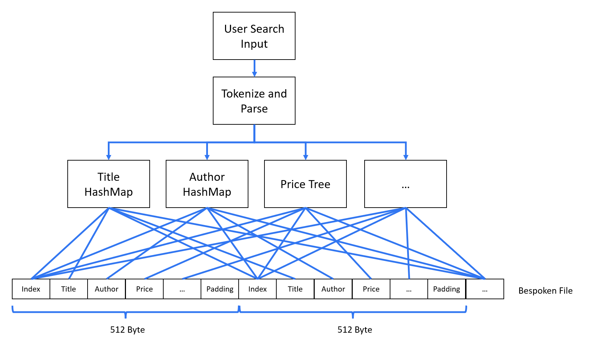

# [G22 - Group 22] Report

## Table of Contents

1. [Team Members and Roles](#team-members-and-roles)
2. [Summary of Individual Contributions](#summary-of-individual-contributions)
3. [Application Description](#application-description)
4. [Application UML](#application-uml)
5. [Application Design and Decisions](#application-design-and-decisions)
6. [Summary of Known Errors and Bugs](#summary-of-known-errors-and-bugs)
7. [Testing Summary](#testing-summary)
8. [Implemented Features](#implemented-features)
9. [Team Meetings](#team-meetings)
10. [Conflict Resolution Protocol](#conflict-resolution-protocol)

## Administrative
- Two user accounts for markers' access are usable on the app's APK (do not change the username and password unless there are exceptional circumstances. Note that they are not real e-mail addresses in use):
   - Username: comp2100@anu.edu.au	Password: comp2100
   - Username: comp6442@anu.edu.au	Password: comp6442

## Team Members and Roles
The key area(s) of responsibilities for each member

| UID       |     Name     |                                                                  Role |
|:----------|:------------:|----------------------------------------------------------------------:|
| u7553225  | Shao An Tay  |                                                               Grammar |
| u7669411  | Songpeng Liu |                                      Architecture, User Operation, IO |
| u7630888  | Xiangji Kong |                                             GUI,Surprise Features iii |
| u7581147  | Yucheng Zhu  | Trees, Data Structure, Data Scraping, Surprise Features i, ii and iv  |

## Summary of Individual Contributions

1. **u7581147, Yucheng Zhu**  I have 25% contribution, as follows:  
  - **Code Contribution in the final App**
    - **Feature complete trees (all classes in the trees package [trees](https://gitlab.cecs.anu.edu.au/u7581147/ga-23s2/-/blob/main/src/BookPlaza/app/src/main/java/com/example/bookplaza/trees/))**
      - Binary Search Tree - class BST: [BST.java](https://gitlab.cecs.anu.edu.au/u7581147/ga-23s2/-/blob/main/src/BookPlaza/app/src/main/java/com/example/bookplaza/trees/BST.java)
        - Look up, insertion, deletion, get root - class BST: [BST.java](https://gitlab.cecs.anu.edu.au/u7581147/ga-23s2/-/blob/main/src/BookPlaza/app/src/main/java/com/example/bookplaza/trees/BST.java)
        - findMin, findMax, isEmpty, updateHeight - class Node: [Node.java](https://gitlab.cecs.anu.edu.au/u7581147/ga-23s2/-/blob/main/src/BookPlaza/app/src/main/java/com/example/bookplaza/trees/Node.java)
        - Find predecessor and successor (Works for both BST and its child class AVL Tree) - class BST: [Node.java](https://gitlab.cecs.anu.edu.au/u7581147/ga-23s2/-/blob/main/src/BookPlaza/app/src/main/java/com/example/bookplaza/trees/Node.java)
        - Get search results within a range (Works for both BST and its child class AVL Tree) - class BST: [BST.java](https://gitlab.cecs.anu.edu.au/u7581147/ga-23s2/-/blob/main/src/BookPlaza/app/src/main/java/com/example/bookplaza/trees/BST.java)
        - Tree Deletion (Works for both BST and its child class AVL Tree) - class BST: [BST.java](https://gitlab.cecs.anu.edu.au/u7581147/ga-23s2/-/blob/main/src/BookPlaza/app/src/main/java/com/example/bookplaza/trees/BST.java) - class AVL:Tree [AVLTree.java](https://gitlab.cecs.anu.edu.au/u7581147/ga-23s2/-/blob/main/src/BookPlaza/app/src/main/java/com/example/bookplaza/trees/AVLTree.java)
      - AVL Search Tree - class AVL: [AVLTree.java](https://gitlab.cecs.anu.edu.au/u7581147/ga-23s2/-/blob/main/src/BookPlaza/app/src/main/java/com/example/bookplaza/trees/AVLTree)
        - All the features inherited from BST
        - left rotate, right rotate, rebalancing - class Node: [AVLTree.java](https://gitlab.cecs.anu.edu.au/u7581147/ga-23s2/-/blob/main/src/BookPlaza/app/src/main/java/com/example/bookplaza/trees/AVLTree.java)
        - AVL insertion and deletion guarantee O(log n) operations even in pathological cases - class Node: [AVLTree.java](https://gitlab.cecs.anu.edu.au/u7581147/ga-23s2/-/blob/main/src/BookPlaza/app/src/main/java/com/example/bookplaza/trees/AVLTree.java)

    - **Surprise features**
      - ranking algorithm with TF-IDF - class
        - Calculating TF-IDF algorithm from all books, each with multiple genres.
        - Calculating, storing and loading the results - class TfIdf: [TfIdf.java](https://gitlab.cecs.anu.edu.au/u7581147/ga-23s2/-/blob/main/src/BookPlaza/app/src/main/java/com/example/bookplaza/surprise/TfIdf.java) - class TfIdfGenerator: [TfIdfGenerator.java](https://gitlab.cecs.anu.edu.au/u7581147/ga-23s2/-/blob/main/src/BookPlaza/app/src/main/java/com/example/bookplaza/surprise/TfIdfGenerator.java)
        -
      - log search results to improve the search algorithm
        - Load tokenised genres to check books' relevancy to groups - class TokenisedGenresReader: [TokenisedGenresReader.java](https://gitlab.cecs.anu.edu.au/u7581147/ga-23s2/-/blob/main/src/BookPlaza/app/src/main/java/com/example/bookplaza/surprise/TokenisedGenresReader.java)
        - Update preferences values according to clicked books and TF-IDF matrix - class MeanPreferencesValuesMapUpdater: [MeanPreferencesValuesMapUpdater.java](https://gitlab.cecs.anu.edu.au/u7581147/ga-23s2/-/blob/main/src/BookPlaza/app/src/main/java/com/example/bookplaza/surprise/MeanPreferencesValuesMapUpdater.java)
        - New algorithm, which I named DictTree, which finds a key in O(1) using HashMap and keeps the values in sorted order using TreeSet
        - Maintains that DictTree property with add, delete and update value (reinsert) - class DictTree: [DictTree.java](https://gitlab.cecs.anu.edu.au/u7581147/ga-23s2/-/blob/main/src/BookPlaza/app/src/main/java/com/example/bookplaza/dictTree/DictTree.java) - class LinkedComparator: [LinkedComparator.java](https://gitlab.cecs.anu.edu.au/u7581147/ga-23s2/-/blob/main/src/BookPlaza/app/src/main/java/com/example/bookplaza/dictTree/LinkedComparator.java)
        - Write preference values (the genres of the clicked book may change the group some books are in) - class ItemDetail: [ItemDetail.java](https://gitlab.cecs.anu.edu.au/u7581147/ga-23s2/-/blob/main/src/BookPlaza/app/src/main/java/com/example/bookplaza/dictTree/ItemDetail.java)
      - group search results for visualisation
        - Change book groups for a new visualisation strategy - class GroupChanger: [GroupChanger.java](surprise/GroupChanger.java) - class BooksGroupsType: [BooksGroupsType.java](https://gitlab.cecs.anu.edu.au/u7581147/ga-23s2/-/blob/main/src/BookPlaza/app/src/main/java/com/example/bookplaza/surprise/BooksGroupsType.java)
        - Change books in the book groups according to previous search result and preference judged by comparing clicked book genres with TF-IDF result on all books genres - class GroupChanger: [SearchResults.java](https://gitlab.cecs.anu.edu.au/u7581147/ga-23s2/-/blob/main/src/BookPlaza/app/src/main/java/com/example/bookplaza/surprise/SearchResults.java)
      - file IO using for mocking testing objects in one line of code (except the try ... catch block).
        - Reads and writes both Android and non-android files using method overloading - class Reader: [Reader.java](https://gitlab.cecs.anu.edu.au/u7581147/ga-23s2/-/blob/main/src/BookPlaza/app/src/main/java/com/example/bookplaza/io/Reader.java) - class Writer: [Writer.java](https://gitlab.cecs.anu.edu.au/u7581147/ga-23s2/-/blob/main/src/BookPlaza/app/src/main/java/com/example/bookplaza/io/Writer.java)
        - Provides methods to reads and write JSON files and Maps - class HashMapReader: [HashMapReader.java](https://gitlab.cecs.anu.edu.au/u7581147/ga-23s2/-/blob/main/src/BookPlaza/app/src/main/java/com/example/bookplaza/io/HashMapReader.java) - class HashMapWriter: [HashMapWriter.java](https://gitlab.cecs.anu.edu.au/u7581147/ga-23s2/-/blob/main/src/BookPlaza/app/src/main/java/com/example/bookplaza/io/HashMapWriter.java)
        - Provides methods to reads and write CSV files into indices - class IndicesReader: [IndicesReader.java](https://gitlab.cecs.anu.edu.au/u7581147/ga-23s2/-/blob/main/src/BookPlaza/app/src/main/java/com/example/bookplaza/io/IndicesReader.java)
      
  - **Code and App Design**
    - Data Structures
      - AVL tree for finding comparable book attributes such as price and rating in O(log n).
      - HashMap for finding exact book attributes such as title and author in O(1).
    - Design Patterns
      - DAO: [BST](https://gitlab.cecs.anu.edu.au/u7581147/ga-23s2/-/blob/main/src/BookPlaza/app/src/main/java/com/example/bookplaza/trees/BST.java) implements [Tree](https://gitlab.cecs.anu.edu.au/u7581147/ga-23s2/-/blob/main/src/BookPlaza/app/src/main/java/com/example/bookplaza/trees/Tree.java). Tree uses [Node](https://gitlab.cecs.anu.edu.au/u7581147/ga-23s2/-/blob/main/src/BookPlaza/app/src/main/java/com/example/bookplaza/trees/Node.java). Code using BST (or its child class AVLTree) instantiates a new Tree.
      - Singleton: Used to store constants [Data](https://gitlab.cecs.anu.edu.au/u7581147/ga-23s2/-/blob/main/src/BookPlaza/app/src/main/java/com/example/bookplaza/io/Data.java)
      - The Iterator pattern to iterate through tree nodes in sorted order. - class TreeIterator: [TreeIterator.java](https://gitlab.cecs.anu.edu.au/u7581147/ga-23s2/-/blob/main/src/BookPlaza/app/src/main/java/com/example/bookplaza/trees/TreeIterator.java) - class BST: [BST.java](https://gitlab.cecs.anu.edu.au/u7581147/ga-23s2/-/blob/main/src/BookPlaza/app/src/main/java/com/example/bookplaza/trees/BST.java)
      - The Humble Object Pattern. For example AttributesLoader has a large readBooksToAttributes(...) method for easy testing, and a tiny readBooksToAttributes(context ...) using the former method to be used in Android. - class AttributesLoader: [AttributesLoader.java](https://gitlab.cecs.anu.edu.au/u7581147/ga-23s2/-/blob/main/src/BookPlaza/app/src/main/java/com/example/bookplaza/trees/AttributesLoader.java)
    - Many classes have 100% test coverage.
    - Extensive use of method overloading. For example, [BST](https://gitlab.cecs.anu.edu.au/u7581147/ga-23s2/-/blob/main/src/BookPlaza/app/src/main/java/com/example/bookplaza/trees/BST.java) overloads [Tree](https://gitlab.cecs.anu.edu.au/u7581147/ga-23s2/-/blob/main/src/BookPlaza/app/src/main/java/com/example/bookplaza/trees/Tree.java).
    - Extensive use of generics. For example, pretty much all classes in the trees package: [trees](https://gitlab.cecs.anu.edu.au/u7581147/ga-23s2/-/blob/main/src/BookPlaza/app/src/main/java/com/example/bookplaza/trees/) and most classes in the io package: [io](https://gitlab.cecs.anu.edu.au/u7581147/ga-23s2/-/blob/main/src/BookPlaza/app/src/main/java/com/example/bookplaza/io/)
    - Followed the Single Responsibility Principle
        

  - **Others**: (only if significant and significantly different from an "average contribution")
    - Scraped 2900 books' data from GoodReads
    - Real authors, titles, rating, number of reviews, genres, sellers, seller's URLs and description. Only the price is stubbed but can be changed in a sprint.
    - Robust and fully automatic Python BeautifulSoup scraper capable of scraping and updating 2900 real books' data every few hours.
    - Set up the Android repo
    - Edited and expanded meeting minutes 2.
    - Pair programming with Tay to integrate trees into searching
    - Working with Xiangji to integrate special features into the GUI
    - Discussed with Songpeng on architecture
    - Frequent discussions on MS Team on code smell, design patterns, testing and so on
        

2. **u7553225, Tay Shao An**  I have 25% contribution, as follows:  
  - **Code Contribution in the final App**
    - Tokenizer - class Tokenizer:[Tokenizer.java](https://gitlab.cecs.anu.edu.au/u7581147/ga-23s2/-/blob/main/src/BookPlaza/app/src/main/java/com/example/bookplaza/search/Tokenizer.java)
    - Parser -  class Parser:[Parser.java](https://gitlab.cecs.anu.edu.au/u7581147/ga-23s2/-/blob/main/src/BookPlaza/app/src/main/java/com/example/bookplaza/search/Parser.java)
    - Search engine - class Search:[Search.java](https://gitlab.cecs.anu.edu.au/u7581147/ga-23s2/-/blob/main/src/BookPlaza/app/src/main/java/com/example/bookplaza/search/Search.java)
    - Exp evaluators(e.g Unionexp, Interexp, Morethanexp ....) - classes:[Search](https://gitlab.cecs.anu.edu.au/u7581147/ga-23s2/-/tree/main/src/BookPlaza/app/src/main/java/com/example/bookplaza/search)
    - ParserTest - classes:[ParserTest](https://gitlab.cecs.anu.edu.au/u7581147/ga-23s2/-/blob/main/src/BookPlaza/app/src/test/java/com/example/bookplaza/trees/ParserTest.java)
    - ParserEvaluateTest - classes:[ParserEvaluateTest](https://gitlab.cecs.anu.edu.au/u7581147/ga-23s2/-/blob/main/src/BookPlaza/app/src/test/java/com/example/bookplaza/trees/ParserEvaluateTest.java)
        

  - **Code and App Design**
    - Iterator design pattern for tokenizer.
    - Error handling within parser which will be caught in the UI and bringing up a toast
    - Separation of Tokenizer and Parser allowing for modular design
        

  - **Others**: (only if significant and significantly different from an "average contribution")
    - Report preparation
    - Slides making and presenting
    - Code integration with frontend and tree-searching with Yucheng and Xiangji
    - Testing the output of the app.
    - Creating and revising the grammar for the app
        

3. **u7669411, Songpeng**  I have 25% contribution, as follows:  
  - **Code Contribution in the final App**
    - **Files Operation** Allow app storing and reading Users and Books information on disk. It adopted factory design pattern and singleton to provide service to higher level.
      - Files Operation Interface- Interface FileOperation: [FileOperation.java](https://gitlab.cecs.anu.edu.au/u7581147/ga-23s2/-/blob/main/src/BookPlaza/app/src/main/java/com/example/bookplaza/file/FileOperation.java)
      - User Files Operation - class UserFileOperation: [UserFileOperation.java](https://gitlab.cecs.anu.edu.au/u7581147/ga-23s2/-/blob/main/src/BookPlaza/app/src/main/java/com/example/bookplaza/file/UserFileOperation.java)
      -  Books Files Operation - class BookFileOperation: [BookFileOperation.java](https://gitlab.cecs.anu.edu.au/u7581147/ga-23s2/-/blob/main/src/BookPlaza/app/src/main/java/com/example/bookplaza/file/BookFileOperation.java)
      -  Files Operation Factory- class FileOperationFactory: [FileOperationFactory.java](https://gitlab.cecs.anu.edu.au/u7581147/ga-23s2/-/blob/main/src/BookPlaza/app/src/main/java/com/example/bookplaza/file/FileOperationFactory.java)
    - **User Operation** Allow GUI and Users conducting various operation, like Login, Logout, Change Image, Register, and interact with low level modules.
      -  User State Interface - Interface UserState: [UserState.java](https://gitlab.cecs.anu.edu.au/u7581147/ga-23s2/-/blob/main/src/BookPlaza/app/src/main/java/com/example/bookplaza/user/UserState.java)
      -  Logged In User State - class LoggedInUserState: [LoggedInUserState.java](https://gitlab.cecs.anu.edu.au/u7581147/ga-23s2/-/blob/main/src/BookPlaza/app/src/main/java/com/example/bookplaza/user/LoggedInUserState.java)
      -  Logged Out User State - class LoggedOutUserState: [LoggedOutUserState.java](https://gitlab.cecs.anu.edu.au/u7581147/ga-23s2/-/blob/main/src/BookPlaza/app/src/main/java/com/example/bookplaza/user/LoggedOutUserState.java)
      -  User Session - class UserSession: [UserSession.java](https://gitlab.cecs.anu.edu.au/u7581147/ga-23s2/-/blob/main/src/BookPlaza/app/src/main/java/com/example/bookplaza/user/UserSession.java)
      -  User Operation - class UserOperation: [UserOperation.java](https://gitlab.cecs.anu.edu.au/u7581147/ga-23s2/-/blob/main/src/BookPlaza/app/src/main/java/com/example/bookplaza/user/UserOperation.java)
    - **Data Objects** Envelope different information to differnt classes. User objects can store and operat users' information, like their id, encraypted password and search history. It implemented methods like checking password or updating and getting information. A Book object can store and operate a single book's inforamtion. A Books object can store and operate a collection of Book. It also provides methods to sort the collection.
      -  User - class User: [User.java](https://gitlab.cecs.anu.edu.au/u7581147/ga-23s2/-/blob/main/src/BookPlaza/app/src/main/java/com/example/bookplaza/data/User.java)
      -  User - class Book: [Book.java](https://gitlab.cecs.anu.edu.au/u7581147/ga-23s2/-/blob/main/src/BookPlaza/app/src/main/java/com/example/bookplaza/data/Book.java)
      -  User - class Books: [Books.java](https://gitlab.cecs.anu.edu.au/u7581147/ga-23s2/-/blob/main/src/BookPlaza/app/src/main/java/com/example/bookplaza/data/Books.java)
        

  - **Code and App Design**
    - Desgined The Application Architecture - picture Architecture: [Architecture.jpg](https://gitlab.cecs.anu.edu.au/u7581147/ga-23s2/-/blob/main/items/Architecture.jpg)
    - Adopted State, Factory, Singleton, Iteration，DAO design patterns to design the project architecture.
      - State Design Pattern - class UserState: [UserState.java](https://gitlab.cecs.anu.edu.au/u7581147/ga-23s2/-/blob/main/src/BookPlaza/app/src/main/java/com/example/bookplaza/user/UserState.java) and class LoggedInUserState: [LoggedInUserState.java](https://gitlab.cecs.anu.edu.au/u7581147/ga-23s2/-/blob/main/src/BookPlaza/app/src/main/java/com/example/bookplaza/user/LoggedInUserState.java) and class LoggedOutUserState: [LoggedOutUserState.java](https://gitlab.cecs.anu.edu.au/u7581147/ga-23s2/-/blob/main/src/BookPlaza/app/src/main/java/com/example/bookplaza/user/LoggedOutUserState.java)
      - Factory Design Pattern - class FileOperationFactory: [FileOperationFactory.java](https://gitlab.cecs.anu.edu.au/u7581147/ga-23s2/-/blob/main/src/BookPlaza/app/src/main/java/com/example/bookplaza/file/FileOperationFactory.java)
      - Singleton Design Pattern - class BookFileOperation: [getInstance()](https://gitlab.cecs.anu.edu.au/u7581147/ga-23s2/-/blob/main/src/BookPlaza/app/src/main/java/com/example/bookplaza/file/BookFileOperation.java#L37-54)
    - Designed and developed the User, Book, Books classes to envelope data.
    - Utilizing md5 algorithm to store encrypted password of user.
    - Utilizing bespoken file to store and read book data via book indexes, which can decrease the read time from O(n) to O(1).
        

  - **Others**:
    - Proposed the topic of the project
    - Solved the image license problem
    - Scripted meeting minutes 2
    - pair programming with Xiangji Kong
        

4. **u7630888, Xiangji Kong**  I have 25% contribution, as follows:  
  - **Code Contribution in the final App**
    - **UI-Layout:** Incorporate suitable layout adjustments in the UI components for portrait and landscape layout variants, as well as different screen sizes.
      - UI interface suitable for vertical layout: [layout-port](https://gitlab.cecs.anu.edu.au/u7581147/ga-23s2/-/tree/main/src/BookPlaza/app/src/main/res/layout-port)
      - UI interface suitable for horizontal layout: [layout-land](https://gitlab.cecs.anu.edu.au/u7581147/ga-23s2/-/tree/main/src/BookPlaza/app/src/main/res/layout-land)
    - **Data-Profile:** Create a Profile Page for Users, which contains a media file (image).
      - class UserCenter: [UserCenter.java](https://gitlab.cecs.anu.edu.au/u7581147/ga-23s2/-/blob/main/src/BookPlaza/app/src/main/java/com/example/bookplaza/UserCenter.java)
    - **Other UI and UI class**
      - Activity for displaying the selected book in real-world website: [ActivityWeb.java](https://gitlab.cecs.anu.edu.au/u7581147/ga-23s2/-/blob/main/src/BookPlaza/app/src/main/java/com/example/bookplaza/ActivityWeb.java)
      - Activity for displaying detail of selected book: [ItemDetail.java](https://gitlab.cecs.anu.edu.au/u7581147/ga-23s2/-/blob/main/src/BookPlaza/app/src/main/java/com/example/bookplaza/ItemDetail.java)
        - Users can click "buy now" button to browse the item in a real-world website
      - Activity for displaying search page: [MainActivity.java](https://gitlab.cecs.anu.edu.au/u7581147/ga-23s2/-/blob/main/src/BookPlaza/app/src/main/java/com/example/bookplaza/MainActivity.java)
        - Users can choose 1 of 3 featured groups to search
        - There is a tip to help users start searching
        - There will be a prompt when the user input is incorrect
      - Activity for displaying search results: [SearchResults.java](https://gitlab.cecs.anu.edu.au/u7581147/ga-23s2/-/blob/main/src/BookPlaza/app/src/main/java/com/example/bookplaza/SearchResults.java)
        - Users can sort items by price and book name
        - This page will recommend top 2 rating books and advertise 2 books
      - Activity for displaying user center, containing profile picture and search history: [UserCenter.java](https://gitlab.cecs.anu.edu.au/u7581147/ga-23s2/-/blob/main/src/BookPlaza/app/src/main/java/com/example/bookplaza/UserCenter.java)
        - Users can click on the profile picture to change it
        - Users can browse the search history and click on the history to search again
        - Users can logout safely
      - Activity for displaying User Login page: [UserLogin.java](https://gitlab.cecs.anu.edu.au/u7581147/ga-23s2/-/blob/main/src/BookPlaza/app/src/main/java/com/example/bookplaza/UserLogin.java)
        - Users can login to their accounts
        - Users can register to new accounts
        - Default users can login directly
          - comp2100@anu.edu.au,comp2100
          - comp6442@anu.edu.au,comp6442
      - Activity for displaying User Register page: [UserRegister.java](https://gitlab.cecs.anu.edu.au/u7581147/ga-23s2/-/blob/main/src/BookPlaza/app/src/main/java/com/example/bookplaza/UserRegister.java)
        - Users can register to new accounts
        - Check the validity of user input (Check if input is empty, Check whether the password entered twice is the same)
      - Utility class for working with checkboxes: [CheckBoxUtil.java](https://gitlab.cecs.anu.edu.au/u7581147/ga-23s2/-/blob/main/src/BookPlaza/app/src/main/java/com/example/bookplaza/util/CheckBoxUtil.java)
        - Unchecks a list of checkboxes to ensure only one option is chosen
        - Gets the text value of the selected checkbox
        

  - **Code and App Design**
    - **UI Design:**
      - Integrated UI with backend code.
      - Designed Reasonable page jumps and toasts to make the interaction between UI and users more intuitive.
      - Used appropriate UI components for input, search, display, filtering, selection, etc.
      - Designed two sets of UI suitable for both landscape and portrait orientation.
      - Designed the appearance of the UI to make it more good-looking.
      - Added tips to make the app easier to use.
      - Used hand-drawing to create a low-fidelity prototype, then used Android Studio to create the sophisticated final UI.
    - **Front-end and back-end integration:**
      - Integrated UI with backend code.
        

  - **Others**:
    - Proposed Team Conflict Resolution Protocol
    - Report/fix bugs at the end of the project
    - Record meeting minutes 3 and 4
    - Make video to show feature
        

## Application Description

BookPlaza is a book finding application that targets readers. It can be used to find books based on the criteria matching user's search criteria.

It also groups books into "Daily Reading", "Hot Feed" and "Explore", based on the users' search history on books' genres.
### Application Use Cases and or Examples

Jackie is a thrifty individual who wants to find a book to read that is not too expensive.
1. He downloads the BookPlaza application and registers a new username and password.
2. In the search bar he inputs in "price < 10" and hits search.
3. The app then returns all the books matching this criteria.
4. Jackie looks through the books returned to find one that he fancies.

Robin is a horror enthusiast who wants to read a good scary novel
1. In the search bar, she inputs in "rating > 3.5 & reviews > 10000 & genre"Horror"".
3. The app then returns all the books matching this criteria.
4. Robin looks through the books returned to find one that she fancies.
5. After done the search, Robin goes to user center and click Logout to logout.

Dennis regularly uses the BookPlaza application but can't remember the queries he performs to find the list of books from a previous session.
1. He opens up and login to the app.
2. He goes to user center.
3. The user center page displays his recent three history searches.
4. He clickes the history search, the app shows the search result again.

Wendy loves beatiful pictures, and she thinks the default profile image is not pretty enough. Therefore, she want to change her profile image.
1. She opens up and login to the app.
2. She goes to user center.
3. She clicks her profile image and selects an image that she likes.
4. Her profile image was updated.

### Application UML and Architecture

BookPlaza adopted MVP structure to design the architecture, which can decouple UI level and module level and use presenter level to interact with them. This architecture can make the project easy to extend and change.

Detailed [UML grahp](UML.jpg)

## Code Design and Decisions

### Data Structures

We use bespoken file to store data on disk; Tree to store numeric information and HashMap to store String inforation in memory. After user initial a search, app will search book in the relevant Tree and HashMap, and provide book indexes. Then the app can use the book indexes to load data from bespoken file.

*We used the following data structures in our project:*

1. AVL tree
    * *Objective: used for keeping data sorted and easily comparable. Inserting, deleting, look-up, find predecessor and successor are all O(log n)*
    * *Code Locations: defined in [package trees](https://gitlab.cecs.anu.edu.au/u7581147/ga-23s2/-/blob/main/src/BookPlaza/app/src/main/java/com/example/bookplaza/trees/)
    * *Reasons:*
        * Does look up, insertion, deletion in O(log n)
        * Keeps data sorted
        * We need to keep numerical book attributes sorted
        * Since we need to look up a book 
        * Books attributes needs to be looked up more often than inserted or deleted. AVL tree is more strictly balanced and has a smaller look-up constant than a Red-Black tree. 

2. HashMap/HashSet
    * *Objective: used for inserting, deleting and finding the exact value in O(1).*
    * *Code Locations: used in many classes such as [Class MeanPreferencesValuesMapUpdater](https://gitlab.cecs.anu.edu.au/u7581147/ga-23s2/-/blob/main/src/BookPlaza/app/src/main/java/com/example/bookplaza/surprise/MeanPreferencesValuesMapUpdater.java) and [BooksAttributes](https://gitlab.cecs.anu.edu.au/u7581147/ga-23s2/-/blob/main/src/BookPlaza/app/src/main/java/com/example/bookplaza/trees/BooksAttributes.java)
    * *Reasons:*
        * It inserts, deletes and finds a key in O(1)
        * We need to find string book attributes such as names and titles quickly
        * We don't need to sort strings

3. DictTree (custom data structure)
   * *Objective: a map like data structure that finds any key in O(1) and keeps values sorted in a TreeSet.*
   * *Code Locations: defined in [DictTree.java](https://gitlab.cecs.anu.edu.au/u7581147/ga-23s2/-/blob/main/src/BookPlaza/app/src/main/java/com/example/bookplaza/dictTree/DictTree.java) and class [LinkedComparator.java](https://gitlab.cecs.anu.edu.au/u7581147/ga-23s2/-/blob/main/src/BookPlaza/app/src/main/java/com/example/bookplaza/dictTree/LinkedComparator.java)
   * *Reasons:*
     * For the surprise feature, the preference needs a map with book indices as key and preference values as values.
     * We want to find any book's preference values through its indices, and grouping books requires its preference values keep sorted
     * Grouping must be fast, so an O(n * log n) re-sorting after each change is not acceptable
     * Key and values must be synchronised after inserting, removing or updating a key-value pair in O(log n)
     * Therefore, Yucheng linked a HashMap and a TreeSet together, letting the TreeSet sort by the HashMap's values
     * We chose TreeSet instead of his own AVLTree, because the preference value needs to be inserted and deleted far more often than looked up.
     * TreeSet uses a Red-Black Tree under the hood, it's less strictly balanced than an AVL tree, and is the best data structure for this application.
  
4. ArrayList
    * *Objective: used to store data with a smaller constant than HashMap. Finding a datum by its index, appending and popping the last datum are all O(1). Also useful for iterating all data in O(n) with a small constant. Other operations are O(n) and shall be avoided*
    * *Code Locations: for example, it's used in [class TfIdfGenerator, lines 53](https://gitlab.cecs.anu.edu.au/u7581147/ga-23s2/-/blob/main/src/BookPlaza/app/src/main/java/com/example/bookplaza/surprise/TfIdfGenerator.java)
    * *Reasons:*
        * It finds an element by index in O(1) and iterates through them in O(n) and it's about twice as fast as HashSet.
        * We need to put elements into a list fast
        * We don't need to look them up by value or to sort them

5. ArrayList in the storage (e.g. SSD instead of RAM)
    * *Objective: Save memory space by O(n). Avoid loading lengthy book descriptions into RAM*.
   * *Before storing, every book object will be padded to same length. Through the index * length, the IO will seek to the precise position and access to the data in O(1), which is much faster than traditional IO approach.*

   * *Code Locations: defined in [Class BookFileOperation](https://gitlab.cecs.anu.edu.au/u7581147/ga-23s2/-/blob/main/src/BookPlaza/app/src/main/java/com/example/bookplaza/file/BookFileOperation.java)*
    * *Reasons:*
        * We want to avoid loading all book info in the memory
        * The few books from the search results do not need the fastest constant
        *It finds any book is O(1), much faster than traditional file IO*

6. User
    * *Objective: Used to store user information*

    * *Code Locations: defined in [Class User](https://gitlab.cecs.anu.edu.au/u7581147/ga-23s2/-/blob/main/src/BookPlaza/app/src/main/java/com/example/bookplaza/data/User.java)*
    * *Reasons:*
        * *It can envelope user inforamtion*
        * *User information can be saved into jason files much more convinently*

7. Book
    * *Objective: Used to store book information*

    * *Code Locations: defined in [Class Book](https://gitlab.cecs.anu.edu.au/u7581147/ga-23s2/-/blob/main/src/BookPlaza/app/src/main/java/com/example/bookplaza/data/Book.java)*
    * *Reasons:*
        * *It can envelope book inforamtion*
        * *book information can be transfer much more convinently in different methods*

8. Books
    * *Objective: Books is a collection of Book*

    * *Code Locations: defined in [Class Books](https://gitlab.cecs.anu.edu.au/u7581147/ga-23s2/-/blob/main/src/BookPlaza/app/src/main/java/com/example/bookplaza/data/Books.java)*
    * *Reasons:*
        * *A collection of Book can be enveloped, and different methods can use an object of Books to transfer inforamtion instead a list of Book*
        * *Different sort methods can be implement in Books class to help sort books in it.*

### Design Patterns

1. *State Pattern*
   * *Objective: used for solve users' operation in different state.*
   * *Code Locations: defined in [Interface UserState](https://gitlab.cecs.anu.edu.au/u7581147/ga-23s2/-/blob/main/src/BookPlaza/app/src/main/java/com/example/bookplaza/user/UserState.java) and Implemented by [Class LoggedInUserState](https://gitlab.cecs.anu.edu.au/u7581147/ga-23s2/-/blob/main/src/BookPlaza/app/src/main/java/com/example/bookplaza/user/LoggedInUserState.java) and [Class LoggedOutUserState](https://gitlab.cecs.anu.edu.au/u7581147/ga-23s2/-/blob/main/src/BookPlaza/app/src/main/java/com/example/bookplaza/user/LoggedOutUserState.java)
   * *Reasons:*
      * *State pattern can solve users' operation with different state well*
      * *UserState Interface can provide contract service to other modules*

2. *Factory Pattern*
   * *Objective: Create file operation to other modules according to provided enum*
   * *Code Locations: defined in [Class FileOperationFactory](https://gitlab.cecs.anu.edu.au/u7581147/ga-23s2/-/blob/main/src/BookPlaza/app/src/main/java/com/example/bookplaza/file/FileOperationFactory.java), and it provides the instance of [Class BookFileOperation](https://gitlab.cecs.anu.edu.au/u7581147/ga-23s2/-/blob/main/src/BookPlaza/app/src/main/java/com/example/bookplaza/file/BookFileOperation.java) and [Class UserFileOperation](https://gitlab.cecs.anu.edu.au/u7581147/ga-23s2/-/blob/main/src/BookPlaza/app/src/main/java/com/example/bookplaza/file/UserFileOperation.java)
   * *Reasons:*
      * *The FileOperationFactory can decouple the create of instance of FileOperation from other module*

3. *Singelton Pattern*
   * *Objective: Return BookFileOperation or UserFileOperation instance*
   * *Code Locations: defined in [Class FileOperationFactory](https://gitlab.cecs.anu.edu.au/u7581147/ga-23s2/-/blob/main/src/BookPlaza/app/src/main/java/com/example/bookplaza/file/FileOperationFactory.java), and it provides the instance of [Class BookFileOperation, Method getInstance()](https://gitlab.cecs.anu.edu.au/u7581147/ga-23s2/-/blob/main/src/BookPlaza/app/src/main/java/com/example/bookplaza/file/BookFileOperation.java#L35-53) and [Class UserFileOperation, Method getInstance](https://gitlab.cecs.anu.edu.au/u7581147/ga-23s2/-/blob/main/src/BookPlaza/app/src/main/java/com/example/bookplaza/file/UserFileOperation.java#L39-50)
   * *Reasons:*
      * *The cost of creating a new File object is big*
      * *Multiple instances will cause synchronizing problems because they may all do different IO operations to a same file*

4. *DAO Pattern*
   * *Objective: Provide a contract service by FileOperation Interface*
   * *Code Locations: defined in [Class FileOperation](https://gitlab.cecs.anu.edu.au/u7581147/ga-23s2/-/blob/main/src/BookPlaza/app/src/main/java/com/example/bookplaza/file/FileOperation.java)
   * *Reasons:*
      * *Decouple file operation with other modules and provide contract service*
      * *Hide lower level details to other modules*

5. *Iterator Pattern*
   * *Objective: Easily iterate any number of nodes in the tree in sorted order*
   * *Code Locations: defined in [Class TreeIterator](https://gitlab.cecs.anu.edu.au/u7581147/ga-23s2/-/blob/main/src/BookPlaza/app/src/main/java/com/example/bookplaza/trees/TreeIterator.java) and [Class BST](https://gitlab.cecs.anu.edu.au/u7581147/ga-23s2/-/blob/main/src/BookPlaza/app/src/main/java/com/example/bookplaza/trees/BST.java)
   * *Reasons:*
      * *Provide a more convenient way to iterate tree elements*

### <u>Grammar(s)</u>

Production Rules:

    <exp>    ::=  <term> || <term> | <exp>
    <term>   ::=  <factor> || <factor> & <term>
    <factor> ::=  <coeff> > v || <coeff> < v || <coeff> = v || titleSearch || genreSearch || <coeff>
    <coefficient> ::= queryTree || ( <exp> )

    *v is an integer or float value

- Grammar specification
  - At the level of "coefficient", a Tree will be returned containing all the values of either Reviews, Rating or Price as specified by the user.
  - At the level of "factor", the result will be an Arraylist of Treedata. Comparison operators (< , > and =) will search across a tree and add all nodes matching the criteria to an Arraylist of Treedata. "titleSearch" and "genreSearch" are operators which search across a hashmap of all books and find books which match the genre and title specified in the grammar.
  - At the level of "term", an Arraylist of treedata will be returned. If the "&" operator is specified, an intersection operation will be applied on two Arraylists(specified by factor and term) returning Treedata values that appear in both lists.
  - At the level of "exp", an Arraylist of treedata will be returned. If the "|" operator is specified, an union operation will be applied on two Arraylists(specified by factor and term) returning all Treedata values that appear in both lists.
- Multiple criterions - Users are able to find the books they desire based on Reviews, Rating, Price, Genre or Title to accommodate users with different preferences and criteria for choosing books.
- Complex Searching - With the "(" and ")" tokens, users are able to perform complex queries to suit their needs by stringing together multiple queries with the union and intersection operator.
- Results over a range - With the comparison operators(">","<","="), users are able to specify the range of values they desire and to narrow their results allowing them to find a favourable book with greater ease.

### <u>Tokenizers and Parsers</u>
- The user input is captured in the search bar and sent to an instance of a searchResultsHandler class who then calls getResultsIndices.
- This input is then used as a parameter for the Tokenizer class. The tokenizer is then passed to a Parser class and parseExp is called to return an expression that will be evaluated with evaluateBooks.
- The Tokenizer uses an iterator design pattern which returns the next token in the string. This allows for the logic to process each token to be segregated from the logic for evaluating an expression allowing for the code to be debugged easily.
- The Tokenizer is able to recognize both integer and float values allowing for a greater range of user inputs. For instance, the Reviews tree is an AVLTree of integer Treedata nodes, and if a float value is provided, it will be automatically cast to an integer and this value will be used to query the tree.

### <u>Search Process and Algorithm(s)</u>
- Sorting
  - There are 2900 books' data. every book has 8 attributes.
  - Numerical attributes - rating, rater count, best price - are sorted by values with AVL tree.
  - String attributes - author, title, main genre, seller, URL - are looked up by their id with a HashMap.
  - The forest and HashMaps are stored in BooksAttributes.
  - Parser calls each attributes, and finds the intersection or union of their id with a set.
  - The overall searching complexity is O(n * log n) for n books.
- Grouping
  - The books are grouped into "Daily Reading", "Hot Feed" and "Explore" according to the books' genres (main and all other genres) and the user's search history.
  - The relevancy of a genre to each book are calculated with TfIdfGenerator and stored in HashMap<Integer, HashMap<Integer, Double>> for O(1) look up.
  - As the user clicks into books, his preference of books are updated according to the TF-IDF map in MeanPreferencesValuesMapUpdater.
  - The preference of books are stored and loaded in DictTree (look up book id in O(1) and sorts preference values in a TreeSet).
  - The three group are tripartited with the preference DictTree's sorted values.
  - Note that preference values doesn't indicate if a book is good, only if the user has read similar genres before.
  - For example, a user can click into the "Explore" group for novelty.

## Implemented Features

### Basic Features
1. [LogIn]. Users must be able to log in (not necessarily sign up) (easy)
   * Code:
     * [Class UserLogin, methods loginButtonListener](https://gitlab.cecs.anu.edu.au/u7581147/ga-23s2/-/blob/main/src/BookPlaza/app/src/main/java/com/example/bookplaza/UserLogin.java)
     * [Class UserOperation, methods login](https://gitlab.cecs.anu.edu.au/u7581147/ga-23s2/-/blob/main/src/BookPlaza/app/src/main/java/com/example/bookplaza/user/UserOperation.java#L63-65)
     * [Class UserSession, methods login](https://gitlab.cecs.anu.edu.au/u7581147/ga-23s2/-/blob/main/src/BookPlaza/app/src/main/java/com/example/bookplaza/user/UserSession.java#L18-25)
     * [Interface UserState, methods login](https://gitlab.cecs.anu.edu.au/u7581147/ga-23s2/-/blob/main/src/BookPlaza/app/src/main/java/com/example/bookplaza/user/UserState.java#L18-19)
     * [Class LoggedOutUserState, methods login](https://gitlab.cecs.anu.edu.au/u7581147/ga-23s2/-/blob/main/src/BookPlaza/app/src/main/java/com/example/bookplaza/user/LoggedOutUserState.java#L19-26)
     * [Class UserFileOperation, methods load](https://gitlab.cecs.anu.edu.au/u7581147/ga-23s2/-/blob/main/src/BookPlaza/app/src/main/java/com/example/bookplaza/file/UserFileOperation.java)
     * [Class User, methods checkPassword getEncryptedPassword](https://gitlab.cecs.anu.edu.au/u7581147/ga-23s2/-/blob/main/src/BookPlaza/app/src/main/java/com/example/bookplaza/data/User.java)
    
   * Description of your implementation:
     * Store default user information in csv file
     * Store new users' information and user data in json files
     * Reading information through file operations
     * After starting the app, enter the User Login page
     * Users can login to their accounts in User Login page by inputting their username and password
     * When the inputted username or password is incorrect, a toast will pop up to prompt the user
    

2. [DataFiles]. BookPlaza provides 2900 valid book item information. The information was collected from different website in real world. BookPlaza can also inport default users from a csv file in the first time time to run.
   * Data:
     * 2900 real books' data scraped from GoodReads: [test_books_list_3000_realistic.csv](https://gitlab.cecs.anu.edu.au/u7581147/ga-23s2/-/blob/main/src/BookPlaza/app/src/main/assets/test_books_list_3000_realistic.csv)
     * [userData.csv](https://gitlab.cecs.anu.edu.au/u7581147/ga-23s2/-/blob/main/src/BookPlaza/app/src/main/assets/userData.csv)
     * Every book's genres in a file, scraped from GoodReads: [genres/](https://gitlab.cecs.anu.edu.au/u7581147/ga-23s2/-/blob/main/src/BookPlaza/app/src/main/assets/genres/)
     * Every book's tokenised genres in a file, scraped from GoodReads: [genresTokenised/](https://gitlab.cecs.anu.edu.au/u7581147/ga-23s2/-/blob/main/src/BookPlaza/app/src/main/assets/genresTokenised/)
   * Code:
     * [Class UserOperation, methods dataCheck](https://gitlab.cecs.anu.edu.au/u7581147/ga-23s2/-/blob/main/src/BookPlaza/app/src/main/java/com/example/bookplaza/user/UserOperation.java#L47-61)
     * [Class BookFileOperation, methods convertData](https://gitlab.cecs.anu.edu.au/u7581147/ga-23s2/-/blob/main/src/BookPlaza/app/src/main/java/com/example/bookplaza/file/BookFileOperation.java#L235-277)
     * [Class UserFileOperation, methods convertData](https://gitlab.cecs.anu.edu.au/u7581147/ga-23s2/-/blob/main/src/BookPlaza/app/src/main/java/com/example/bookplaza/file/UserFileOperation.java#L158-184)
    
   * Description of Implementation:
     * After starting the app, the app will check the user data from the userData.csv to see whether their accounts exist. If their accounts do not exist, the app will register their accounts. And the the app will convert the book data from a csv file to a bespoken file.
     * If the higher level wants to load book information from the file, it just needs to provide book index. If higher level wants to save book information to the file, it just needs to provide Book objects.
     * If the higher level wants to load user information from the file, it just needs to provide user id. If higher level wants to save user information to the file, it just needs to provide User objects.
    

3. [LoadShowData]. When a user is logged in, load data (from the file(s) and/or Firebase) at regular time intervals,
   and visualise the same in the App. (e.g., If the main page contains a list of featured products, the user may see
   an increased number of products; as well as receive notifications from interactions simulated from the data
   stream). (medium)
   * Code:
     * [Class SearchResults](https://gitlab.cecs.anu.edu.au/u7581147/ga-23s2/-/blob/main/src/BookPlaza/app/src/main/java/com/example/bookplaza/SearchResults.java)
     * [Class UserOperation, methods searchBooks](https://gitlab.cecs.anu.edu.au/u7581147/ga-23s2/-/blob/main/src/BookPlaza/app/src/main/java/com/example/bookplaza/user/UserOperation.java#L71-73)
     * [Class BookFileOperation, methods load](https://gitlab.cecs.anu.edu.au/u7581147/ga-23s2/-/blob/main/src/BookPlaza/app/src/main/java/com/example/bookplaza/file/BookFileOperation.java#L169-202)
     * [Class UserCenter](https://gitlab.cecs.anu.edu.au/u7581147/ga-23s2/-/blob/main/src/BookPlaza/app/src/main/java/com/example/bookplaza/UserCenter.java)
     * [Class UserOperation, methods getSearchHistory](https://gitlab.cecs.anu.edu.au/u7581147/ga-23s2/-/blob/main/src/BookPlaza/app/src/main/java/com/example/bookplaza/user/UserOperation.java#L90-92)
     * [Class UserFileOperation, methods load](https://gitlab.cecs.anu.edu.au/u7581147/ga-23s2/-/blob/main/src/BookPlaza/app/src/main/java/com/example/bookplaza/file/UserFileOperation.java#L85-116)
    
   * Description of your implementation:
     * After user conducts a search, the GUI will provide a list of Book Indexes to BookFileOperation class, then the load method in BookFileOperation class will read the data from disk and provide it to GUI. GUI would use a ListView to show them. If there are any advertised items, GUI will show them in special fields.
     * After user login, the app will load data from a .json file. If the user enters UserCenter page, the page will get image and search history record from the User object, and show them on the page.
    

4. [Search]. Users must be able to search for information on your app. (medium)
   * Code:
     * [Class MainActivity, methods searchButtonListener](https://gitlab.cecs.anu.edu.au/u7581147/ga-23s2/-/blob/main/src/BookPlaza/app/src/main/java/com/example/bookplaza/MainActivity.java)
     * [Class SearchResults, methods refreshResult](https://gitlab.cecs.anu.edu.au/u7581147/ga-23s2/-/blob/main/src/BookPlaza/app/src/main/java/com/example/bookplaza/SearchResults.java)
     * [Class searchResultsHandler, methods getResultsIndices](https://gitlab.cecs.anu.edu.au/u7581147/ga-23s2/-/blob/main/src/BookPlaza/app/src/main/java/com/example/bookplaza/searchResults/SearchResultsHandler.java)
     * [Class IndicesReader, methods toIndices](https://gitlab.cecs.anu.edu.au/u7581147/ga-23s2/-/blob/main/src/BookPlaza/app/src/main/java/com/example/bookplaza/io/IndicesReader.java)
     * [Class AttributesLoader, methods readBooksToAttributes](https://gitlab.cecs.anu.edu.au/u7581147/ga-23s2/-/blob/main/src/BookPlaza/app/src/main/java/com/example/bookplaza/trees/AttributesLoader.java)
     * [Class Tokenizer, methods Tokenizer next current](https://gitlab.cecs.anu.edu.au/u7581147/ga-23s2/-/blob/main/src/BookPlaza/app/src/main/java/com/example/bookplaza/search/Tokenizer.java)
     * [Class Parser, methods Parser parseExp](https://gitlab.cecs.anu.edu.au/u7581147/ga-23s2/-/blob/main/src/BookPlaza/app/src/main/java/com/example/bookplaza/search/Parser.java)
     * [Abstract Class Exp, methods evaluateBooks](https://gitlab.cecs.anu.edu.au/u7581147/ga-23s2/-/blob/main/src/BookPlaza/app/src/main/java/com/example/bookplaza/search/Exp.java)
     * [Class UserOperation, methods searchBooks](https://gitlab.cecs.anu.edu.au/u7581147/ga-23s2/-/blob/main/src/BookPlaza/app/src/main/java/com/example/bookplaza/user/UserOperation.java)
     * [Class UserSession, methods searchBooks](https://gitlab.cecs.anu.edu.au/u7581147/ga-23s2/-/blob/main/src/BookPlaza/app/src/main/java/com/example/bookplaza/user/UserSession.java)
     * [Interface UserState, methods searchBooks](https://gitlab.cecs.anu.edu.au/u7581147/ga-23s2/-/blob/main/src/BookPlaza/app/src/main/java/com/example/bookplaza/user/UserState.java)
     * [Class LoggedInUserState, methods searchBooks](https://gitlab.cecs.anu.edu.au/u7581147/ga-23s2/-/blob/main/src/BookPlaza/app/src/main/java/com/example/bookplaza/user/LoggedInUserState.java)
     * [Class BookFileOperation, methods load](https://gitlab.cecs.anu.edu.au/u7581147/ga-23s2/-/blob/main/src/BookPlaza/app/src/main/java/com/example/bookplaza/file/BookFileOperation.java)
     * [Class Book, methods Book](https://gitlab.cecs.anu.edu.au/u7581147/ga-23s2/-/blob/main/src/BookPlaza/app/src/main/java/com/example/bookplaza/data/Book.java)
    
   * Description of your implementation:
     * In Search page users can input information of products to search (e.g. price<30 & rating>4)
     * Users can choose 1 of 3 featured groups to search
     * There is a tip to help users start searching
     * There will be a prompt when the user input is incorrect
    

### Custom Features
Feature Category: Search-related features  
1. [Search-Filter]. Sort and filter a list of items returned from searches, with the use of suitable UI components (easy)
   * Code:
     * [Class SearchResults, methods spinnerListener refreshResult](https://gitlab.cecs.anu.edu.au/u7581147/ga-23s2/-/blob/main/src/BookPlaza/app/src/main/java/com/example/bookplaza/SearchResults.java)
     * [Class Books, methods sortByName sortByPriceLowToHigh sortByPriceHighToLow](https://gitlab.cecs.anu.edu.au/u7581147/ga-23s2/-/blob/main/src/BookPlaza/app/src/main/java/com/example/bookplaza/data/Books.java)
     * [Class Book, methods getters](https://gitlab.cecs.anu.edu.au/u7581147/ga-23s2/-/blob/main/src/BookPlaza/app/src/main/java/com/example/bookplaza/data/Book.java)
    
   * Description of your implementation:
     * In Search Results page users can sort items by price or book name using appropriate UI components
     * Use TreeMap to sort books by different attributes
    

Feature Category: UI Design and Testing  
2. [UI-Layout]. Incorporate suitable layout adjustments in the UI components for portrait and landscape layout
   variants, as well as different screen sizes. (easy)
   * Code:
     * UI interface suitable for vertical layout: [layout-port](https://gitlab.cecs.anu.edu.au/u7581147/ga-23s2/-/tree/main/src/BookPlaza/app/src/main/res/layout-port)
     * UI interface suitable for horizontal layout: [layout-land](https://gitlab.cecs.anu.edu.au/u7581147/ga-23s2/-/tree/main/src/BookPlaza/app/src/main/res/layout-land)
    
   * Description of your implementation:
     * Designed two sets of UI suitable for both landscape and portrait orientation
    

Feature Category: Greater Data Usage, Handling and Sophistication  
3. [Data-Formats]. Read data from local files in at least 2 different formats (JSON, XML, etc.). (easy)
    * Code:
     * [Class BookFileOperation](https://gitlab.cecs.anu.edu.au/u7581147/ga-23s2/-/blob/main/src/BookPlaza/app/src/main/java/com/example/bookplaza/file/BookFileOperation.java)
     * [Class UserFileOperation](https://gitlab.cecs.anu.edu.au/u7581147/ga-23s2/-/blob/main/src/BookPlaza/app/src/main/java/com/example/bookplaza/file/UserFileOperation.java)
    
   * Description of your implementation:
     * For book data, the app will read from a csv file and then covernt data into a bespoken file, to achieve a data load time complexity to O(1)
     * For user data, the app will load default user data from a csv file if the default user accounts do not exist. Then the app will convert the data to User objects, and the app will store user inforamtion into .json files. When users login, the app will load data from user .json file. The user password is encrypted in the .json files.
    

4. [Data-Profile]. Create a Profile Page for Users or any Entities, which contains a media file (image, animation
   (e.g. gif), video). (easy)
    * Code:
     * [Class UserCenter, methods userImageListener](https://gitlab.cecs.anu.edu.au/u7581147/ga-23s2/-/blob/main/src/BookPlaza/app/src/main/java/com/example/bookplaza/UserCenter.java)
     * [Class UserOperation, methods getInstance getUerImageUri changeImage](https://gitlab.cecs.anu.edu.au/u7581147/ga-23s2/-/blob/main/src/BookPlaza/app/src/main/java/com/example/bookplaza/user/UserOperation.java)
     * [Class UserSession, methods getUerImageUri changeImage](https://gitlab.cecs.anu.edu.au/u7581147/ga-23s2/-/blob/main/src/BookPlaza/app/src/main/java/com/example/bookplaza/user/UserSession.java)
     * [Interface UserState, methods changeImage](https://gitlab.cecs.anu.edu.au/u7581147/ga-23s2/-/blob/main/src/BookPlaza/app/src/main/java/com/example/bookplaza/user/UserState.java)
     * [Class LoggedInUserState, methods searchBooks](https://gitlab.cecs.anu.edu.au/u7581147/ga-23s2/-/blob/main/src/BookPlaza/app/src/main/java/com/example/bookplaza/user/LoggedInUserState.java)
     * [Class UserFileOperation, methods copyImage save](https://gitlab.cecs.anu.edu.au/u7581147/ga-23s2/-/blob/main/src/BookPlaza/app/src/main/java/com/example/bookplaza/file/UserFileOperation.java)
     * [Class User, methods getUsername setIsCustomImage](https://gitlab.cecs.anu.edu.au/u7581147/ga-23s2/-/blob/main/src/BookPlaza/app/src/main/java/com/example/bookplaza/data/User.java)
    
   * Description of your implementation:
     * In User Center page users can see a default profile picture
     * Users can click on the profile picture to change it
     * Read/store path of user profile picture from json file
    

5. [Data-Deletion]. Implemented deletion for BST and AVL tree. The deletion is used to delete books from book groups. (medium)
    * Code:
        * BST deletion which AVL tree also uses: [BST](https://gitlab.cecs.anu.edu.au/u7581147/ga-23s2/-/tree/main/src/BookPlaza/app/src/main/trees/BST.java)
        * AVL deletion which guarantees O(log n) through rebalancing: [AVLTree](https://gitlab.cecs.anu.edu.au/u7581147/ga-23s2/-/tree/main/src/BookPlaza/app/src/main/trees/AVLTree.java)
        * BooksAttributes store numerical data in AVL trees: [BooksAttributes](https://gitlab.cecs.anu.edu.au/u7581147/ga-23s2/-/tree/main/src/BookPlaza/app/src/main/trees/BooksAttributes.java)
        * GroupChanger deletes data in AVL trees and HashMaps as BooksAttributes fields: [GroupChanger, methods delete move](https://gitlab.cecs.anu.edu.au/u7581147/ga-23s2/-/tree/main/src/BookPlaza/app/src/main/surprise/GroupChanger.java)
        * Deleting books may happen after a search: [SearchResults, method onCreate](https://gitlab.cecs.anu.edu.au/u7581147/ga-23s2/-/tree/main/src/BookPlaza/app/src/main/surprise/SearchResults.java)
           
    * Description of your implementation:
        * BST deletion deletes a node and maintains the BST property.
        * AVL deletion uses rebalancing to restore the AVL property so that the difference of heights between a node's two child trees is no greater than one.
        * All numerical (comparable) book attributes are stored in AVL trees.
        * Deleting books in the AVL trees updates the books in each group and provides a more relevant search experience.
           
Feature Category: Voiced Feature: [User Register](https://wattlecourses.anu.edu.au/mod/forum/discuss.php?d=904124)  
6. [Reg]. New users will be able to register the application by providing email and password. After registering the application, they should be able to log in and use the search function. (easy)
   * Code:
     * [Class UserRegister, methods buttonListener](https://gitlab.cecs.anu.edu.au/u7581147/ga-23s2/-/blob/main/src/BookPlaza/app/src/main/java/com/example/bookplaza/UserRegister.java)
     * [Class UserOperation, methods getInstance register](https://gitlab.cecs.anu.edu.au/u7581147/ga-23s2/-/blob/main/src/BookPlaza/app/src/main/java/com/example/bookplaza/user/UserOperation.java)
     * [Class UserSession, methods register](https://gitlab.cecs.anu.edu.au/u7581147/ga-23s2/-/blob/main/src/BookPlaza/app/src/main/java/com/example/bookplaza/user/UserSession.java)
     * [Interface UserState, methods register](https://gitlab.cecs.anu.edu.au/u7581147/ga-23s2/-/blob/main/src/BookPlaza/app/src/main/java/com/example/bookplaza/user/UserState.java)
     * [Class LoggedOutUserState, methods register](https://gitlab.cecs.anu.edu.au/u7581147/ga-23s2/-/blob/main/src/BookPlaza/app/src/main/java/com/example/bookplaza/user/LoggedOutUserState.java)
     * [Class UserFileOperation, methods load save](https://gitlab.cecs.anu.edu.au/u7581147/ga-23s2/-/blob/main/src/BookPlaza/app/src/main/java/com/example/bookplaza/file/UserFileOperation.java)
     * [Class User, methods User](https://gitlab.cecs.anu.edu.au/u7581147/ga-23s2/-/blob/main/src/BookPlaza/app/src/main/java/com/example/bookplaza/data/User.java)
    
   * Description of your implementation:
     * In User Register page users can register to new accounts
     * Check the validity of user input:
       * Check if input is empty
       * Check whether the password entered twice is the same
       * Read/store data of registered users in json file
    

### Surprised Features

#### (i) how to rank the items returned for a given search (a ranking algorithm);
   * Code:
     * TF-IDF calculation, save and lading:
       * [Class TfIdf](https://gitlab.cecs.anu.edu.au/u7581147/ga-23s2/-/blob/main/src/BookPlaza/app/src/main/java/com/example/bookplaza/surprise/TfIdf.java)
       * [Class TfIdfGenerator](https://gitlab.cecs.anu.edu.au/u7581147/ga-23s2/-/blob/main/src/BookPlaza/app/src/main/java/com/example/bookplaza/surprise/TfIdfGenerator.java)
       * [Class TokenisedGenresReader](https://gitlab.cecs.anu.edu.au/u7581147/ga-23s2/-/blob/main/src/BookPlaza/app/src/main/java/com/example/bookplaza/surprise/TokenisedGenresReader.java)
     * DictTree for fast looking up in O(1) and keeping it sorted after each O(log n) operation:
         * [Class DictTree](https://gitlab.cecs.anu.edu.au/u7581147/ga-23s2/-/blob/main/src/BookPlaza/app/src/main/java/com/example/bookplaza/dictTree/DictTree.java)
         * [Class LinkedComparator](https://gitlab.cecs.anu.edu.au/u7581147/ga-23s2/-/blob/main/src/BookPlaza/app/src/main/java/com/example/bookplaza/dictTree/LinkedComparator.java)
    
   * Description of your implementation:
     * We use the TF-IDF algorithm to find out the user's preferred genres and put them into three different groups.
     * Each book has many genres. We tokenise every genre to a unique integer, and we use this data to calculate TF-IDF matrix (Stored in HashMap<Integer, HashMap<Integer, Double>> for fast look up)
     * Each book has many genres tokenised as HashSet<Integer> for O(1) look up.
     * Using TF-IDF matrix and tokenised book genres, a user has a table of preference values.
       * The preference values are stored in Yucheng's custom DictTree data structure, so that the keys can be looked up in O(1) and values are keep sorted as a TreeSet.
       * DictTree links a HashMap and TreeSet together. Looking up a key in O(1) will also get it's corresponding value.
       * We can add (put), remove, or update values (reinsert) in O(log n). The DictTree will maintain its properties.
    

#### (ii) log previous searches and user information to improve search results;
   * Code:
     * [Class SearchResults, methods onCreate](https://gitlab.cecs.anu.edu.au/u7581147/ga-23s2/-/blob/main/src/BookPlaza/app/src/main/java/com/example/bookplaza/SearchResults.java)
     * [Class UserCenter, methods onCreate](https://gitlab.cecs.anu.edu.au/u7581147/ga-23s2/-/blob/main/src/BookPlaza/app/src/main/java/com/example/bookplaza/UserCenter.java)
     * [Class UserOperation, methods saveSearchHistory getSearchHistory](https://gitlab.cecs.anu.edu.au/u7581147/ga-23s2/-/blob/main/src/BookPlaza/app/src/main/java/com/example/bookplaza/user/UserOperation.java)
     * [Class UserSession, methods saveSearchHistory getSearchHistory](https://gitlab.cecs.anu.edu.au/u7581147/ga-23s2/-/blob/main/src/BookPlaza/app/src/main/java/com/example/bookplaza/user/UserSession.java)
     * [Class LoggedInUserState, methods saveSearchHistory getSearchHistory](https://gitlab.cecs.anu.edu.au/u7581147/ga-23s2/-/blob/main/src/BookPlaza/app/src/main/java/com/example/bookplaza/user/LoggedInUserState.java)
     * [Class UserFileOperation, methods save](https://gitlab.cecs.anu.edu.au/u7581147/ga-23s2/-/blob/main/src/BookPlaza/app/src/main/java/com/example/bookplaza/file/UserFileOperation.java)
     * [Class User, methods User addSearchHistory getSearchHistory](https://gitlab.cecs.anu.edu.au/u7581147/ga-23s2/-/blob/main/src/BookPlaza/app/src/main/java/com/example/bookplaza/data/User.java)

     * Preference value and group changing module:
       * [Class MeanPreferencesValuesMapUpdater](https://gitlab.cecs.anu.edu.au/u7581147/ga-23s2/-/blob/main/src/BookPlaza/app/src/main/java/com/example/bookplaza/surprise/MeanPreferencesValuesMapUpdater.java)
       * [Class GroupChanger](https://gitlab.cecs.anu.edu.au/u7581147/ga-23s2/-/blob/main/src/BookPlaza/app/src/main/java/com/example/bookplaza/surprise/GroupChanger.java)
     * Related GUI classes:
       * [Class SearchResults](https://gitlab.cecs.anu.edu.au/u7581147/ga-23s2/-/blob/main/src/BookPlaza/app/src/main/java/com/example/bookplaza/SearchResults.java)
       * [Class ItemDetail](https://gitlab.cecs.anu.edu.au/u7581147/ga-23s2/-/blob/main/src/BookPlaza/app/src/main/java/com/example/bookplaza/ItemDetail.java)

    
   * Description of your implementation:
     * 1. Revisit previous searches easily
       * The app record the user's search results, and users can view them in the user center.
       * Users can click on their search results to search again
       * Store/read user search history data from json file
     * 2. Change search groups by search history
       * We tripartite books in the preference values DictTree into three group, "Daily Reading", "Hot Feed" and "Explore" according to the sorted values in preference values
       * Each time a user clicks a book, we find the genres this book have in the TF-IDF matrix. Then we add the corresponding TF-IDF value of each book to the preference values DictTree.
       * As the values get updated, the values of the preference values DictTree change their sorting order, so do their corresponding keys of book indices change their groups.
       * In this way, the books in different groups slowly change as the user clicked into many books.
       * However, the user can always click into other groups to explore novel genres. This updates the preference values and avoids the bubbling effects.
    

#### (iii) a strategy for showing ads (promoted items);
   * Code:
     * [Class SearchResults, methods refreshResult](https://gitlab.cecs.anu.edu.au/u7581147/ga-23s2/-/blob/main/src/BookPlaza/app/src/main/java/com/example/bookplaza/SearchResults.java)
     * [Class Books, methods getBooksList sortByRating](https://gitlab.cecs.anu.edu.au/u7581147/ga-23s2/-/blob/main/src/BookPlaza/app/src/main/java/com/example/bookplaza/data/Books.java)
     * [Class Book, methods getters](https://gitlab.cecs.anu.edu.au/u7581147/ga-23s2/-/blob/main/src/BookPlaza/app/src/main/java/com/example/bookplaza/data/Book.java)
    
   * Description of your implementation:
     * The advertised books are stored in an indexed file
     * When the user searches, the intersection of the search results and the advertised book data is obtained
     * In the meantime, recommend (but not advertise) the two highest-rated books
     * In order to improve user experience, each search only displays 2 advertised books and 2 recommended books
     * Advertised books are stored/read as indices
    

#### (iv) a new strategy for visualising the traditional list of results.
   * Code:
     * [Class SearchResultsHandler, methods getResultsIndices](https://gitlab.cecs.anu.edu.au/u7581147/ga-23s2/-/blob/main/src/BookPlaza/app/src/main/java/com/example/bookplaza/searchResults/SearchResultsHandler.java)
     * Related GUI classes:
         * [Class MainActivity](https://gitlab.cecs.anu.edu.au/u7581147/ga-23s2/-/blob/main/src/BookPlaza/app/src/main/java/com/example/bookplaza/MainActivity.java)
    
   * Description of your implementation:
     * We classify books into 3 groups, "Daily Reading", "Hot Feed" and "Explore"
     * This can be seen on the radio buttons above the search bar
     * Users can choose one of the groups to search.
     * Using the algorithm explained in feature i, a frequent user is more likely to find their familiar genres in the "Daily Reading" group, and may explore new genres in the "Explore" group.
     * However, we avoid changing the groups too quickly to give the user a consistent experience in a few days (parameter can be tweaked).
    

 

## Summary of Known Errors and Bugs

No known bugs

Sorting 2900 books with several O(n * log n) trees on multiple attributes can introduce ~2 seconds' delay for some search strings.
While this is faster than opening a webpage, it's not real time.
In the future sprints, we can show the user 20 books at a time and load more if the user presses the next button using the Iterator pattern in BST/AVL tree.

 

## Testing Summary

1. Tests Overview
   - Code: [test package, every file](https://gitlab.cecs.anu.edu.au/u7581147/ga-23s2/-/tree/main/src/BookPlaza/app/src/test)
   - *Number of test cases: 87 test taking 1 sec 952 ms
   - *Code coverage: 70% including GUI.

2. Tests for Data Operation
   - Code: [Class DataOperationTest](https://gitlab.cecs.anu.edu.au/u7581147/ga-23s2/-/blob/main/src/BookPlaza/app/src/test/java/dataOperationTest/DataOperationTest.java)
   - *Number of test cases: 2 test taking 217 ms
   - *Code coverage: All classes are much higher than 70%*
   - *Unit tests: tested each method all classes*
   - *Integration tests: tested intergration between UserOperation and FileOperation, UserOperation and User, UserOperation and Book, UserOperation and Books, FileOperation and User, FileOperation and Book, FileOperation and Books, *

   

3.  Tests for Tree
   - Code: [test/tree package, every file](https://gitlab.cecs.anu.edu.au/u7581147/ga-23s2/-/tree/main/src/BookPlaza/app/src/test/java/com/example/bookplaza/trees)
   - *Number of test cases: 53 test taking 749 ms
   - *Code coverage: All classes are much higher than 70%*
   - *Unit tests: tested each method all classes*
   - *Integration tests: tested intergration between Search and Tree*

   

4.  Tests for Surprise Feature
   - Code: [Class ParserTest](https://gitlab.cecs.anu.edu.au/u7581147/ga-23s2/-/blob/main/src/BookPlaza/app/src/test/java/grammar/ParserTest.java)
   - *Number of test cases: 16 test taking 1s 348 ms
   - *Code coverage: Most classes are much higher than 70%*
   - *Unit tests: tested each method all classes*
   - *Integration tests: tested intergration between Tfldf and Tree*

   
  

## Team Management

### Meetings Records

- *[Team Meeting 1](https://gitlab.cecs.anu.edu.au/u7581147/ga-23s2/-/blob/main/items/meeting1.md)*
- *[Team Meeting 2](https://gitlab.cecs.anu.edu.au/u7581147/ga-23s2/-/blob/main/items/meeting2.md)*
- *[Team Meeting 3](https://gitlab.cecs.anu.edu.au/u7581147/ga-23s2/-/blob/main/items/meeting3.md)*
- *[Team Meeting 4](https://gitlab.cecs.anu.edu.au/u7581147/ga-23s2/-/blob/main/items/meeting4.md)*

### Conflict Resolution Protocol

1. Active Listening:
    - Encourage active listening when conflicts arise.
    - Team members should listen to each other without interrupting and ask clarifying questions to fully understand the issue.

2. Stay Calm and Respectful:
    - Emphasize the importance of maintaining a calm and respectful tone during conflict discussions.
    - Avoid blaming or using accusatory language.

3. Identify the Root Cause:
    - Work together to identify the underlying issues causing the conflict.
    - Often, conflicts arise from miscommunication, misunderstandings, or differing perspectives.

4. Brainstorm Solutions:
    - Encourage the team to brainstorm potential solutions to the conflict.
    - Consider the pros and cons of each solution.

5. Select a Solution:
    - Once multiple solutions have been proposed, select the one that best addresses the root cause and aligns with the team's goals.

6. Document Agreements:
    - Write down the agreed-upon solution and any action steps.
    - Ensure that everyone is clear on their responsibilities and deadlines.

7. Follow Up:
    - Set a follow-up date to review the progress made in implementing the agreed-upon solution.
    - Discuss any adjustments or additional steps needed if the conflict persists.

8. Learn and Grow:
    - Encourage the team to view conflicts as opportunities for growth and learning.
    - Discuss what can be done differently in the future to prevent similar conflicts.

9. Continuous Improvement:
    - Regularly review and refine the conflict resolution process based on team feedback and evolving needs.

#### If a member fails to meet the initial plan and/or deadlines
1. Listen Actively: Allow the team member to explain their reasons.
2. Stay Calm and Respectful: Maintain a respectful tone.
3. Identify the Root Cause: Determine why the deadline was missed.
4. Brainstorm Solutions: Discuss how to address the issue.
5. Select a Solution: Choose a solution that aligns with team goals.
6. Document Agreements: Write down the agreed-upon solution and new deadlines.
7. Follow Up: Review progress and make adjustments.
8. Learn and Improve: Use the experience for growth and continuously refine the processes.

#### If your group has issues, how will your group reach consensus or solve the problem?
1. Active Listening: Ensure everyone has an opportunity to express their concerns.
2. Stay Calm and Respectful: Maintain a respectful and non-confrontational tone.
3. Identify the Root Cause: Understand the underlying reasons behind the issue.
4. Brainstorm Solutions: Encourage the group to generate potential solutions.
5. Select a Solution: Choose a solution that aligns with the group's goals.
6. Document Agreements: Write down the agreed-upon solution and action steps.
7. Follow Up: Review progress and make adjustments if needed.
8. Learn and Improve: Use the experience as an opportunity for growth and continuously refine the processes.

#### If a member gets sick, what is the solution? Alternatively, what is your plan to mitigate the impact of unforeseen incidents for this 6-to-8-week project?
1. Adjust Roles and Responsibilities: Redistribute the sick member's tasks among the team, if possible.
2. Set New Deadlines: Modify project timelines to accommodate the absence.
3. Offer Support: Ensure the sick member gets the necessary support and time to recover.
4. Continuous Communication: Keep lines of communication open to stay updated on the member's condition and progress.

To mitigate the impact of unforeseen incidents:
1. Contingency Planning: Develop contingency plans for key roles to address sudden absences.
2. Cross-Training: Cross-train team members so that they can step in when needed.
3. Buffer Time: Include buffer time in your project schedule to account for unexpected delays.
4. Regular Updates: Keep stakeholders informed about any changes and potential risks.
5. Learn from Past Incidents: Review and learn from past incidents to improve future planning and risk management.
